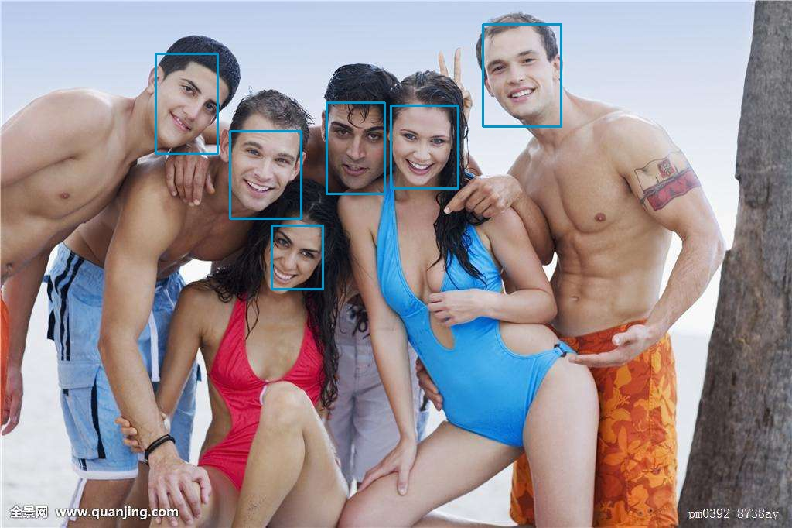

# mtcnn-tensorflow

This is a tensorflow implementation of MTCNN  of [Zhang's](https://github.com/kpzhang93?tab=repositories) work,It's very fast and accurate. If you want to know more detail, please visit [link](https://arxiv.org/pdf/1604.02878.pdf). The current weight is not trained well. I will provide the train data generation code and the train function file using a jupyter notebook with clear notes. I hope this open source project can help you better understand mtcnn face detect.

## Require
* python-3.6
* opencv3
* tensorflow
* sklearn
* matplotlib

## Test

`python Mtcnn/test.py`

## Result

